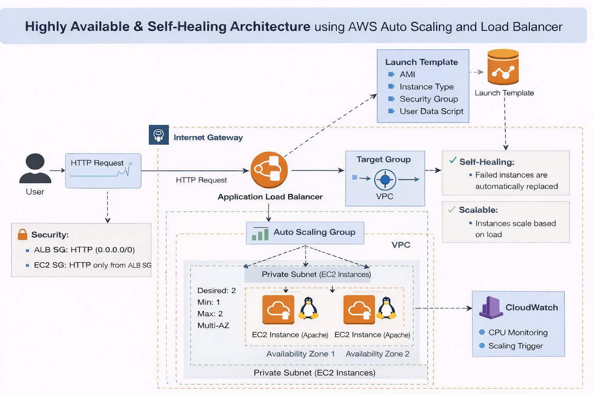

# 🚀 AWS Auto Scaling with Application Load Balancer

> 💡 Designed a production-style self-healing system where instances are disposable and automatically replaced.

---

## 📌 Project Overview

Designed and implemented a **self-healing, highly available AWS architecture** using an Application Load Balancer (ALB) and Auto Scaling Group (ASG).

This system automatically distributes incoming traffic and replaces unhealthy instances to ensure continuous availability and fault tolerance.

> 🔗 This project extends my previous ALB + EC2 setup by introducing Auto Scaling for dynamic scaling and automated recovery.

---

## ❗ Problem Statement

Traditional single EC2 deployments suffer from:

* Single point of failure
* No fault tolerance
* No automatic recovery

---

## ✅ Solution

Implemented a highly available architecture using:

* Application Load Balancer for traffic distribution
* Auto Scaling Group for self-healing and scaling
* Multi-AZ deployment for fault tolerance

---

## 🏗️ Architecture



---

## ⚙️ Services Used

* Amazon EC2
* Auto Scaling Group (ASG)
* Application Load Balancer (ALB)
* Target Group
* Amazon VPC
* Security Groups

---

## 🔄 Architecture Flow

1. User sends request via internet
2. Request is received by **Application Load Balancer (ALB)**
3. ALB forwards traffic to **Target Group**
4. Target Group routes requests to EC2 instances managed by **Auto Scaling Group (ASG)**
5. EC2 instances process and return the response

---

## ⚙️ Key Implementation

* Created a **Launch Template** with automated EC2 setup using user data
* Configured **Auto Scaling Group** (Min: 1 | Desired: 1 | Max: 2)
* Deployed instances across **multiple Availability Zones**
* Set up **Application Load Balancer** with Target Group
* Configured **health checks** to route traffic only to healthy instances
* Verified **self-healing behavior** through instance replacement

---

## 📂 Project Structure

```bash
aws-auto-scaling-system/
│
├── README.md
├── architecture/
├── screenshots/
├── scripts/
├── documentation/
└── demo/
```

---

## 📸 Screenshots

Detailed step-by-step screenshots are available in the [`screenshots`](./screenshots/) folder.

---

## ⚙️ Scripts

User data script used for EC2 automation is available in the [`scripts`](./scripts/) folder.

---

## 📄 Documentation

📑 Full project documentation:
👉 [View Documentation](./documentation/project-documentation.pdf)

---

## 🎥 Demo

▶️ ALB Demo:
https://drive.google.com/file/d/1hyCbynfree-1M-e7yQ62qNyDFdWpMASl/view

▶️ Auto Scaling Demo:
https://drive.google.com/file/d/10YKQ4NUY7O5Hfo0SZGCq7WQ4CgqE0Btu/view

---

## 💡 Key Learnings

* Auto Scaling enables **self-healing infrastructure**
* Instances are **disposable and automatically replaced**
* Load Balancer distributes traffic across multiple instances
* Health checks ensure only healthy instances receive traffic
* Multi-AZ deployment improves availability and fault tolerance

---

## 🔥 Important Concepts

* Auto Scaling maintains **desired capacity automatically**
* Target Group acts as a **bridge between ALB and EC2**
* Health checks control traffic routing decisions
* Security Groups enforce **least privilege access (ALB → EC2 only)**

---

## 🎯 Interview Questions

* What is the role of a Launch Template in Auto Scaling?
* How does ASG handle unhealthy instances?
* Where are health checks configured?
* Why is Target Group required between ALB and EC2?
* Difference between static EC2 setup and Auto Scaling architecture?

---

## 💥 Key Takeaway

> This project demonstrates how production-grade cloud architectures achieve high availability, fault tolerance, and automated recovery using load balancing and Auto Scaling.
